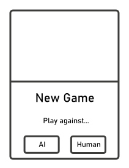

<!-- theme gaia -->

<!-- paginate: false -->

# Teamprojekt SS2022
## - A Web-Platform for Turn Based Games -

---

<!-- paginate: true -->

# The Team

<!--  
TODO
-->

---

# The Teaching Phase
- Important programming concepts
- Typescript
- CSS 

<!--  
Grundlagen zu Typescript
OOP
Trennung von Model View Container
TODO ?
Mockups
Statemachines
PubSub-Konzept
Testen mit Mocha
CSS Grundlagen
Socket.io
-->

---

# The Teaching Phase
## *Implementation of Nim*

<!--  
Was ist Nim?
- Wie spielt man das?
TODO Wie haben wir gelerntes Umgesetzt?
Kleine Aufgaben zwischen den Meetings, um gelerntes anwenden zu können
-->

---

---

# Independent planning
## *Scrum Meetings*

<!--
TODO kurze Beschreibung Ablauf Scrum Meetings
Aufgabenverteilung
-->

---

# Independent planning
## *Game selection*

<!-- 
erst mal Connect-4
TODO Wieso haben wir uns dafür entschieden?
-->

---

# Homepage
## *Login/Register*

---

# Homepage
## *Achievements*

---

# Homepage
## *Human vs Human*
## *Human vs AI*

---

# Connect-4
## *UI*

<!--  
Styling (Hover mit eingeblendetem Stein)
-->

---

# Connect-4
## *Logic*

<!--  
State machine
-->

---

# Connect-4
## *AI*

<!--  
Zwei Schwierigkeitsstufen erklären
Minmax Algorithm (depth first search)
-->

---

# Tic Tac Toe
## *The third game*

---

# Tic Tac Toe
## *UI*

<!--  

-->

---

# Tic Tac Toe
## *Logic*

<!--  
State machine
-->

---

# Tic Tac Toe
## *AI*

<!--  
Zwei Schwierigkeitsstufen erklären
- Einfach: depth limited search tiefe von 1
- Schwer: Minmax Algorithm
-->

---

# Database

<!-- 
Anforderungen
Nutzen
Probleme
-->

---

# Styling
## *...*

---

# Styling
## *Accessibility*

<!-- 
Schwarz-Weiß
Farbschwächen
etc.
-->

---

# Outlook
## *New Features*

<!-- 
Freundeslisten + Einladungen
-->

---

# Outlook 
## *Extensibility*

<!-- 
Automatisieren der Einbindung von Spielen
Alle wichtigen Verknüpfungen werden erstellt
Alle Template Dateien werden erstellt
User muss nur an wenigen Stellen eigenen Code einfügen
-->

---

# Outlook
## *Maintainability*
## *Testibility*

<!--  
Interfaces zu den UIs von den Spielen
- Um tests schreiben zu können mit dummy UIs
- Um sich auf bestimmte Dinge verlassen zu können
  - Funktionen
  - Andere Elemente

refactoring, dass alles auf einer html-Seite ist
- Man lädt immer eine neue UI, wenn man die Seite wechseln möchte
- Die URL bleibt immer gleich
- Vorteile:
  - Variablen müssen nicht unter verschiedenen Seiten ausgetauscht werden, sondern sind immer bekannt
  - Man könnte aus einem Spiel raustabben und sich die Achievements anschauen ohne, dass das aktuelle Spiel unterbrochen wird
- Wieso bisher nicht gemacht?
  - Mit anderem Ansatz angefangen
  - Im laufe der Zeit gemerkt, dass anderer Ansatz einige Dinge einfacher macht
  - Zeit hat gefehlt, das ganze Projekt umzustrukturieren
-->

---